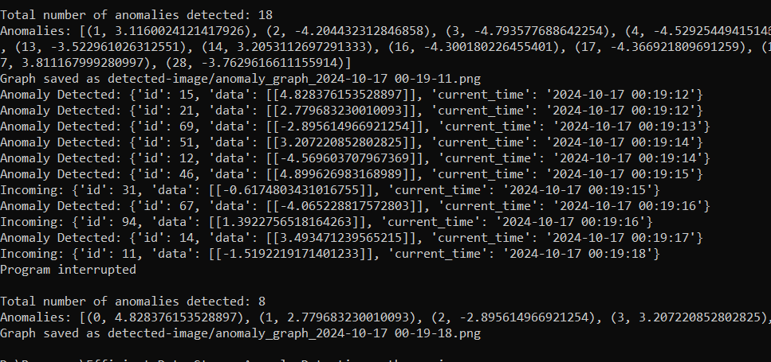
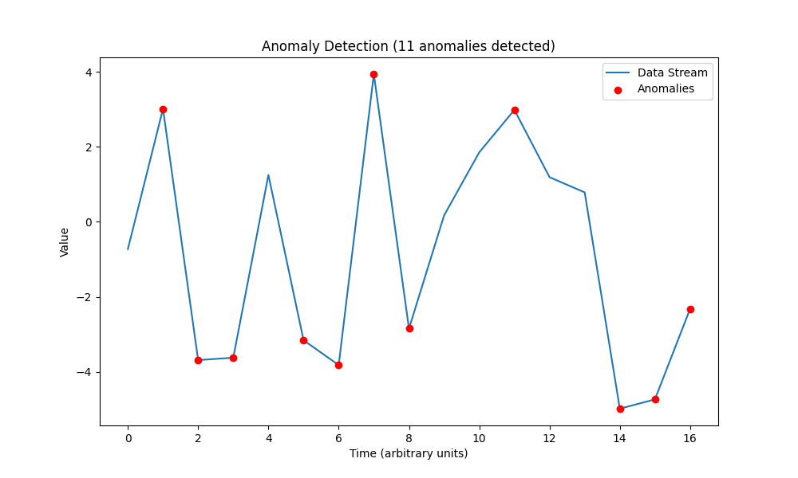

# Efficient Data Stream Anomaly Detection

## Project Overview

The **Efficient Data Stream Anomaly Detection** project aims to develop a Python script that detects anomalies in a continuous data stream. This stream simulates real-time sequences of floating-point numbers, which can represent various metrics such as financial transactions, system metrics, or sensor data. The primary focus is on identifying unusual patterns, such as exceptionally high values or deviations from the norm, enabling prompt action and improved data integrity.

## Objectives
1. **Algorithm Selection**: Implemented the **Isolation Forest** algorithm for anomaly detection, capable of adapting to concept drift and seasonal variations.
2. **Data Stream Simulation**: Developed a function to simulate a continuous data stream, integrating regular patterns, seasonal elements, and random noise.
3. **Anomaly Detection**: Created a real-time mechanism to accurately identify and flag anomalies as data is streamed.
4. **Optimization**: Ensured the algorithm's performance is optimized for both speed and efficiency, allowing for rapid anomaly detection.
5. **Visualization**: Built a user-friendly real-time visualization tool to display the incoming data stream alongside detected anomalies.

## Working

### main.py
This file serves as the main driver code of the project. It requires the following files to function:
- **model_prod.py**: Implements the Isolation Forest model for anomaly detection, generates random data points, and trains the model, which is then saved to `isolation_forest.joblib`.
- **settings.py**: Contains parameters that drive the code. Modifying these parameters will alter the output accordingly. It includes three key settings:
  - **Delay**: Time interval for generating new data points.
  - **Outliers Generation Probability**: Probability that a generated point is an anomaly (e.g., a value of 0.2 indicates a 20% chance of anomaly).
  - **Visualization**: Controls the display of the run-time figure.

### model_prod.py
This file employs the **Isolation Forest** algorithm for anomaly detection. It generates random numbers for real-time data simulation and fits this data into the Isolation Forest model. The trained model is saved in the `isolation_forest.joblib` file using scikit-learn.

### anomaly.py
This file defines the `anomaly_dect` function, which performs anomaly detection using the previously stored Isolation Forest model. Key features include:
- **Logging**: Sets up logging to write information to a file named `anomaly.log`.
- **Continuous Data Generation**: The function continuously generates random data points and checks for anomalies using the pre-trained Isolation Forest model.
- **Optional Visualization**: Controlled by the `VISUALIZATION` constant from `settings.py`.
- **Anomaly Logging**: If an anomaly is detected, it is logged, and the data point is marked in the visualization (if enabled).
- **Iteration Delay**: The function pauses for a specified delay (`DELAY`) between iterations for visualization updates.
- **Indefinite Loop**: The loop runs continuously until the model file is not found or an explicit interruption occurs.

## Requirements

- Implemented using **Python 3.x**.
- numpy
- scikit_learn
- joblib
- matplotlib
- keyboard


## Project Structure

```
Efficient-Data-Stream-Anomaly-Detection/
│
├── anomaly.py         # Contains the anomaly detection logic
├── main.py            # Main entry point to run the application
├── detected-image     # Saved all visualization graph
├── model_prod.py      # Defines and trains the Isolation Forest model
├── settings.py        # Configuration file for parameters
├── requirements.txt    # List of dependencies (if applicable)
└── README.md          # Project documentation
```

## Installation

1. Clone the repository:

   ```bash
   git clone https://github.com/vatsalpatel1123/Efficient-Data-Stream-Anomaly-Detection.git
   cd Efficient-Data-Stream-Anomaly-Detection
   ```

2. Install the required libraries: If applicable, use the `requirements.txt` file to install dependencies:

   ```bash
   pip install -r requirements.txt
   ```

## Usage

1. **Run the application:** Execute the `model_prod.py` and `main.py` files to start the anomaly detection process:

   ```bash
   python model_prod.py
   ```
   ```bash
   python main.py
   ```

2. **Monitor the output:** The application will display incoming data values in real-time. Anomalies will be highlighted in the visualization.

3. **Save the graph:** To save the current visualization graph, including the count of anomalies and marked anomalies, press the q key. Each time you press q, the program will store the graph image in the detected-image folder.

4. **Stop the application:** To stop the application, press Ctrl + C. This will terminate the program without saving any additional images.

## Algorithm Explanation

This project employs the **Isolation Forest** algorithm for anomaly detection, capable of adapting to concept drift and seasonal variations. This method effectively identifies outliers based on statistical thresholds and historical data patterns. A detailed explanation of the algorithm and its effectiveness can be found in the comments within the code.

## Screenshots

### Terminal continuous data streams with anomaly information


### Anomaly Detection in Visualization



## Contributing

Contributions are welcome! If you have suggestions for improvements or additional features, please open an issue or submit a pull request.

1. Fork the repository.
2. Create a new branch:

   ```bash
   git checkout -b feature-branch
   ```

3. Make your changes and commit them:

   ```bash
   git commit -m 'Add new feature'
   ```

4. Push to the branch:

   ```bash
   git push origin feature-branch
   ```

5. Open a pull request.

## Acknowledgments

All credit for this project goes to Cobblestone Energy for providing the opportunity to work on this assessment task. I am grateful for the chance to showcase my skills through this project.

I kindly request the Cobblestone Energy team to review my work. 

For any further communication, please feel free to reach out to me:

**Name:** Vatsal Patel  
**Email:** vatsal.private@gmail.com


